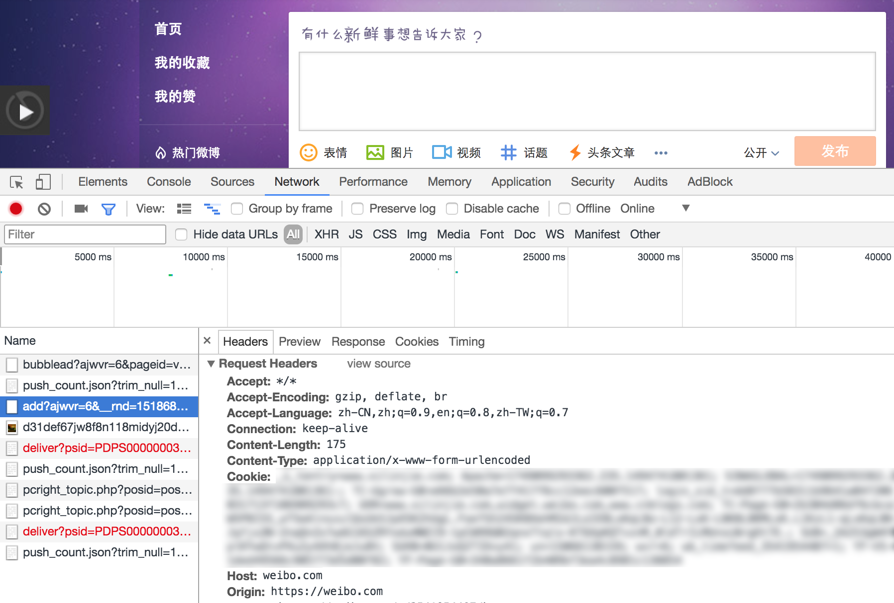

# weibo-post

Post weibo text from https based node.

## Usage

Using npm:
```shell
$ npm i --save-dev weibo-post
```

In Node.js:
```js
var weiboPost = require('weibo-post');

weiboPost.setCookie('your weibo login cookie');
weiboPost.post('your post content');
```

## How to get *weibo cookie*?



    1. Open weibo.com by Chrome.
    2. F12 open Terminal, change to Network tab.
    3. Post a weibo, follow the image indicate.
